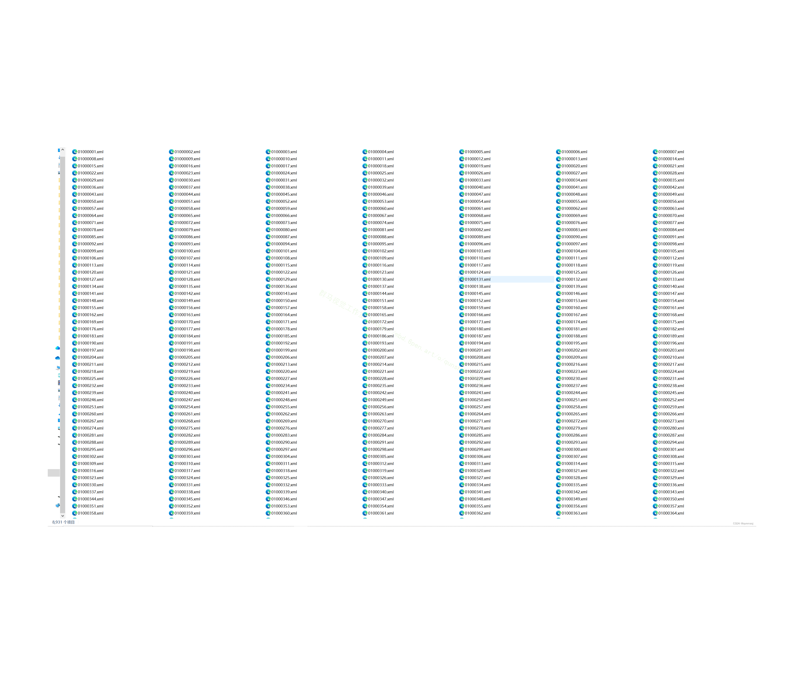
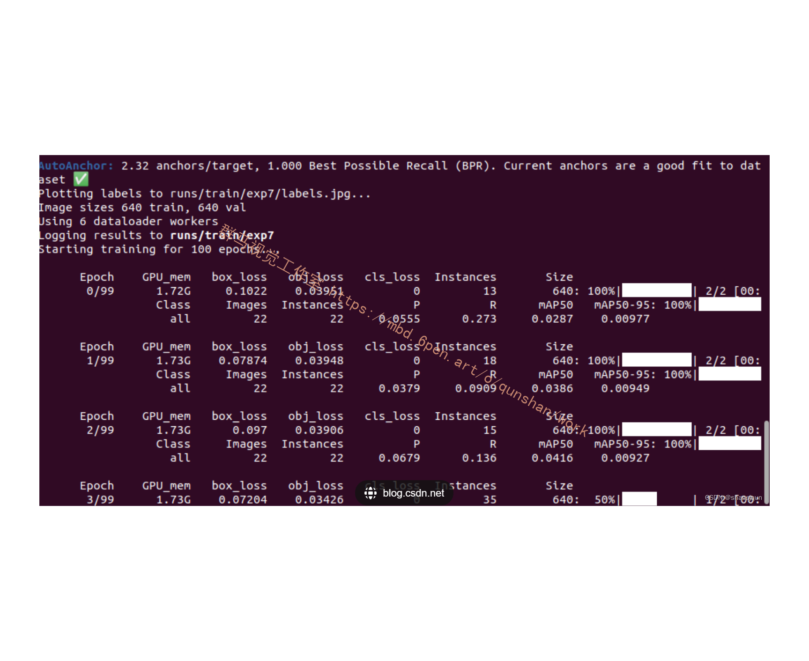
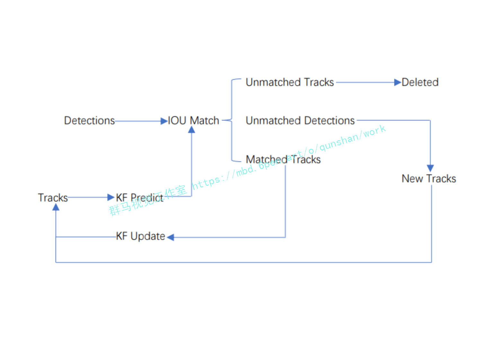
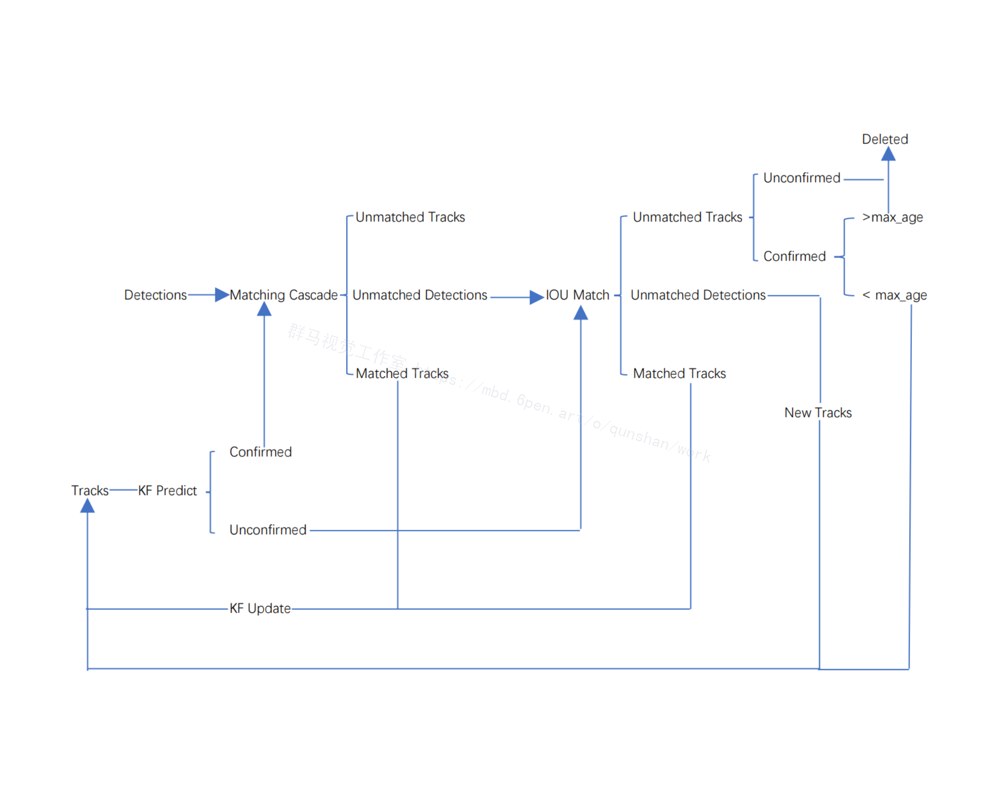

# 1.研究背景与意义


随着城市化进程的加快和人口的不断增长，城市交通问题日益突出。行人作为城市交通中不可忽视的一部分，其行为分析和统计对于城市交通管理和规划具有重要意义。特别是在人流密集的地区，如商业区、火车站、机场等，行人的流动情况直接影响到交通流量的分配和道路的设计。因此，开发一种高效准确的行人测速统计系统对于城市交通管理具有重要意义。

传统的行人测速统计方法主要依赖于人工计数，即通过人工观察和记录行人通过某一区域的数量和时间来进行统计。然而，这种方法存在着许多问题，如人工计数的准确性和效率低下等。同时，随着计算机视觉和深度学习技术的快速发展，基于图像和视频的行人测速统计方法逐渐成为研究热点。

近年来，深度学习技术在计算机视觉领域取得了重大突破，尤其是目标检测和跟踪方面。Deepsort是一种基于深度学习的多目标跟踪算法，能够在复杂场景下实现高效准确的目标跟踪。OpenCV是一个开源的计算机视觉库，提供了丰富的图像处理和分析工具。结合Deepsort和OpenCV，可以实现对行人的准确跟踪和测速统计。

基于Deepsort和OpenCV的ROI区域行人测速统计系统具有以下几个方面的意义：

1. 提高测速统计的准确性：传统的人工计数方法容易受到人为因素的影响，如观察角度、计数错误等。而基于Deepsort和OpenCV的系统可以通过图像和视频数据进行自动化的行人跟踪和测速统计，大大提高了测速统计的准确性。

2. 提高测速统计的效率：传统的人工计数方法需要大量的人力和时间，效率低下。而基于Deepsort和OpenCV的系统可以实现自动化的行人跟踪和测速统计，大大提高了测速统计的效率。

3. 为城市交通管理和规划提供科学依据：行人的流动情况对于城市交通管理和规划具有重要意义。基于Deepsort和OpenCV的系统可以实时监测和统计行人的流动情况，为城市交通管理和规划提供科学依据。

4. 推动计算机视觉和深度学习技术的应用：基于Deepsort和OpenCV的系统是计算机视觉和深度学习技术在交通领域的应用之一，可以推动这些技术在其他领域的应用和发展。

综上所述，基于Deepsort和OpenCV的ROI区域行人测速统计系统具有重要的研究背景和意义。通过提高测速统计的准确性和效率，为城市交通管理和规划提供科学依据，推动计算机视觉和深度学习技术的应用，该系统有望在实际应用中发挥重要作用。

# 2.图片演示


# 3.视频演示
[基于Deepsort和OpenCV的ROI区域行人测速统计系统_哔哩哔哩_bilibili](https://www.bilibili.com/video/BV1gw411M77K/?spm_id_from=333.999.0.0&vd_source=ff015de2d29cbe2a9cdbfa7064407a08)

# 4.数据集的采集＆标注和整理
#### 图片的收集
首先，我们需要收集所需的图片。这可以通过不同的方式来实现，例如使用现有的[数据集voc_from_mot20](https://mbd.pub/o/bread/ZZaTmZtw)。


#### 使用labelImg进行标注
labelImg是一个图形化的图像注释工具，支持VOC和YOLO格式。以下是使用labelImg将图片标注为VOC格式的步骤：

（1）下载并安装labelImg。
（2）打开labelImg并选择“Open Dir”来选择你的图片目录。
（3）为你的目标对象设置标签名称。
（4）在图片上绘制矩形框，选择对应的标签。
（5）保存标注信息，这将在图片目录下生成一个与图片同名的XML文件。
（6）重复此过程，直到所有的图片都标注完毕。


#### 转换为YOLO格式
由于YOLO使用的是txt格式的标注，我们需要将VOC格式转换为YOLO格式。可以使用各种转换工具或脚本来实现。

下面是一个简单的方法是使用Python脚本，该脚本读取XML文件，然后将其转换为YOLO所需的txt格式。
```python
#!/usr/bin/env python3
# -*- coding: utf-8 -*-

import xml.etree.ElementTree as ET
import os

classes = []  # 初始化为空列表

CURRENT_DIR = os.path.dirname(os.path.abspath(__file__))

def convert(size, box):
    dw = 1. / size[0]
    dh = 1. / size[1]
    x = (box[0] + box[1]) / 2.0
    y = (box[2] + box[3]) / 2.0
    w = box[1] - box[0]
    h = box[3] - box[2]
    x = x * dw
    w = w * dw
    y = y * dh
    h = h * dh
    return (x, y, w, h)

def convert_annotation(image_id):
    in_file = open('./label_xml\%s.xml' % (image_id), encoding='UTF-8')
    out_file = open('./label_txt\%s.txt' % (image_id), 'w')  # 生成txt格式文件
    tree = ET.parse(in_file)
    root = tree.getroot()
    size = root.find('size')
    w = int(size.find('width').text)
    h = int(size.find('height').text)

    for obj in root.iter('object'):
        cls = obj.find('name').text
        if cls not in classes:
            classes.append(cls)  # 如果类别不存在，添加到classes列表中
        cls_id = classes.index(cls)
        xmlbox = obj.find('bndbox')
        b = (float(xmlbox.find('xmin').text), float(xmlbox.find('xmax').text), float(xmlbox.find('ymin').text),
             float(xmlbox.find('ymax').text))
        bb = convert((w, h), b)
        out_file.write(str(cls_id) + " " + " ".join([str(a) for a in bb]) + '\n')

xml_path = os.path.join(CURRENT_DIR, './label_xml/')

# xml list
img_xmls = os.listdir(xml_path)
for img_xml in img_xmls:
    label_name = img_xml.split('.')[0]
    print(label_name)
    convert_annotation(label_name)

print("Classes:")  # 打印最终的classes列表
print(classes)  # 打印最终的classes列表

```

#### 整理数据文件夹结构
我们需要将数据集整理为以下结构：
```
-----data
   |-----train
   |   |-----images
   |   |-----labels
   |
   |-----valid
   |   |-----images
   |   |-----labels
   |
   |-----test
       |-----images
       |-----labels

```
确保以下几点：

所有的训练图片都位于data/train/images目录下，相应的标注文件位于data/train/labels目录下。
所有的验证图片都位于data/valid/images目录下，相应的标注文件位于data/valid/labels目录下。
所有的测试图片都位于data/test/images目录下，相应的标注文件位于data/test/labels目录下。
这样的结构使得数据的管理和模型的训练、验证和测试变得非常方便。

#### 模型的训练


# 5.核心代码讲解

#### 5.1 detector_CPU.py

```python

class Detector:
    def __init__(self):
        self.img_size = 640
        self.threshold = 0.4
        self.stride = 1

        self.weights = './weights/output_of_small_target_detection.pt'

        self.device = '0' if torch.cuda.is_available() else 'cpu'
        self.device = select_device(self.device)
        model = attempt_load(self.weights, map_location=self.device)
        model.to(self.device).eval()
        model.float()

        self.m = model
        self.names = model.module.names if hasattr(
            model, 'module') else model.names

    def preprocess(self, img):
        img0 = img.copy()
        img = letterbox(img, new_shape=self.img_size)[0]
        img = img[:, :, ::-1].transpose(2, 0, 1)
        img = np.ascontiguousarray(img)
        img = torch.from_numpy(img).to(self.device)
        img = img.float()
        img /= 255.0
        if img.ndimension() == 3:
            img = img.unsqueeze(0)
        return img0, img

    def detect(self, im):
        im0, img = self.preprocess(im)
        pred = self.m(img, augment=False)[0]
        pred = pred.float()
        pred = non_max_suppression(pred, self.threshold, 0.4)

        boxes = []
        for det in pred:
            if det is not None and len(det):
                det[:, :4] = scale_coords(
                    img.shape[2:], det[:, :4], im0.shape).round()

                for *x, conf, cls_id in det:
                    lbl = self.names[int(cls_id)]
                    if lbl not in ['person']:
                        continue
                    x1, y1 = int(x[0]), int(x[1])
                    x2, y2 = int(x[2]), int(x[3])
                    xm = x2
                    ym = y2
                    boxes.append(
                            (x1, y1, x2, y2, lbl, conf))
        return boxes
```

这个程序文件名为`detector_CPU.py`，主要功能是进行目标检测。它使用了PyTorch库进行模型加载和推理，以及使用OpenCV库进行图像处理。

在`Detector`类的初始化方法中，定义了一些参数，包括图像大小、阈值和步长。同时，加载了预训练模型的权重文件，并将模型移动到可用的设备上进行推理。

`preprocess`方法用于对输入图像进行预处理，包括调整图像大小、转换颜色通道、转换为Tensor等操作。

`detect`方法用于执行目标检测，首先对输入图像进行预处理，然后使用加载的模型进行推理，得到预测结果。接着，对预测结果进行非最大抑制处理，筛选出置信度较高的目标框。最后，根据目标框的类别进行筛选，只保留类别为'person'的目标框，并将其保存在一个列表中。

整个程序的功能就是对输入图像进行目标检测，并返回检测到的人的目标框的坐标和类别信息。

#### 5.2 detector_GPU.py

```python

class Detector:
    def __init__(self):
        self.img_size = 640
        self.threshold = 0.1
        self.stride = 1
        self.weights = './weights/Attention_mechanism.pt'
        self.device = '0' if torch.cuda.is_available() else 'cpu'
        self.device = select_device(self.device)
        model = attempt_load(self.weights, map_location=self.device)
        model.to(self.device).eval()
        model.half()
        self.m = model
        self.names = model.module.names if hasattr(model, 'module') else model.names

    def preprocess(self, img):
        img0 = img.copy()
        img = letterbox(img, new_shape=self.img_size)[0]
        img = img[:, :, ::-1].transpose(2, 0, 1)
        img = np.ascontiguousarray(img)
        img = torch.from_numpy(img).to(self.device)
        img = img.half()
        img /= 255.0
        if img.ndimension() == 3:
            img = img.unsqueeze(0)
        return img0, img

    def detect(self, im):
        im0, img = self.preprocess(im)
        pred = self.m(img, augment=False)[0]
        pred = pred.float()
        pred = non_max_suppression(pred, self.threshold, 0.4)
        boxes = []
        for det in pred:
            if det is not None and len(det):
                det[:, :4] = scale_coords(img.shape[2:], det[:, :4], im0.shape).round()
                for *x, conf, cls_id in det:
                    lbl = self.names[int(cls_id)]
                    if lbl not in ['bicycle','car', 'bus', 'truck']:
                        continue
                    x1, y1 = int(x[0]), int(x[1])
                    x2, y2 = int(x[2]), int(x[3])
                    xm = x2
                    ym = y2
                    if  ym +0.797* xm -509.77 > 0:
                       boxes.append((x1, y1, x2, y2, lbl, conf))
        return boxes
```

这个程序文件名为detector_GPU.py，它是一个用于目标检测的类`Detector`的定义。这个类有以下几个方法：

1. `__init__`方法：初始化一些参数，包括图像大小、阈值、步长、模型权重文件路径等。同时，根据是否有GPU可用，选择设备进行模型加载和推理。

2. `preprocess`方法：对输入的图像进行预处理，包括调整图像大小、转换颜色通道顺序、转换为numpy数组、转换为torch张量等操作。

3. `detect`方法：对输入的图像进行目标检测。首先调用`preprocess`方法对图像进行预处理，然后使用加载的模型对图像进行推理，得到预测结果。最后，根据预测结果的置信度和类别信息，筛选出特定类别的目标框，并返回这些目标框的坐标和类别信息。

整个程序的功能是使用GPU进行目标检测，输入一张图像，输出图像中特定类别目标的框的坐标和类别信息。

#### 5.3 fit.py

```python


class PedestrianSpeedEstimator:
    def __init__(self, yolo_weights, deepsort_weights, video_path):
        self.yolo = YOLODetector(yolo_weights)
        self.deepsort = DeepSort(deepsort_weights)
        self.video_path = video_path

    def detect_and_track(self):
        cap = cv2.VideoCapture(self.video_path)
        ret, frame = cap.read()
        if not ret:
            print("Failed to read video")
            return

        roi = cv2.selectROI("Select ROI", frame, fromCenter=False, showCrosshair=True)
        cv2.destroyAllWindows()

        while cap.isOpened():
            ret, frame = cap.read()
            if not ret:
                break

            roi_frame = frame[int(roi[1]):int(roi[1] + roi[3]), int(roi[0]):int(roi[0] + roi[2])]

            detections = self.yolo.detect(roi_frame)

            tracker_outputs = self.deepsort.update(detections)

            for track in tracker_outputs:
                if track.is_confirmed() and track.time_since_update > 1:
                    continue

                speed = self.calculate_speed(track)

                bbox = track.to_tlbr()
                cv2.rectangle(roi_frame, (int(bbox[0]), int(bbox[1])), (int(bbox[2]), int(bbox[3])), (255, 0, 0), 2)
                cv2.putText(roi_frame, f"ID: {track.track_id}, Speed: {speed:.2f} m/s",
                            (int(bbox[0]), int(bbox[1]) - 10), 0, 0.5, (255, 0, 0), 2)

            frame[int(roi[1]):int(roi[1] + roi[3]), int(roi[0]):int(roi[0] + roi[2])] = roi_frame
            cv2.rectangle(frame, (int(roi[0]), int(roi[1])), (int(roi[0] + roi[2]), int(roi[1] + roi[3])), (0, 255, 0),
                          2)

            cv2.imshow('Frame', frame)

            if cv2.waitKey(1) & 0xFF == ord('q'):
                break

        cap.release()
        cv2.destroyAllWindows()

    def calculate_speed(self, track):
        if len(track.history) < 2:
            return 0.0

        prev_bbox, curr_bbox = track.history[-2], track.history[-1]
        dy = (curr_bbox[1] + curr_bbox[3]) / 2 - (prev_bbox[1] + prev_bbox[3]) / 2
        dx = (curr_bbox[0] + curr_bbox[2]) / 2 - (prev_bbox[0] + prev_bbox[2]) / 2

        speed = (dy ** 2 + dx ** 2) ** 0.5

        return speed
```

这个程序文件名为fit.py，它实现了一个行人速度估计器。它使用了预训练的YOLO模型进行行人检测，并使用DeepSort算法进行行人跟踪。程序首先打开一个视频文件，然后让用户选择感兴趣区域（ROI）。接下来，程序会循环读取视频帧，截取ROI区域，并使用YOLO模型进行行人检测。然后，程序会使用DeepSort算法对行人进行跟踪，并计算行人的速度。最后，程序会将检测框和速度信息绘制到图像上，并显示在窗口中。用户可以按下键盘上的'q'键来退出程序。

#### 5.4 tracker.py

```python

class ObjectTracker:
    def __init__(self):
        cfg = get_config()
        cfg.merge_from_file("./deep_sort/configs/deep_sort.yaml")
        self.deepsort = DeepSort(cfg.DEEPSORT.REID_CKPT,
                                 max_dist=cfg.DEEPSORT.MAX_DIST, min_confidence=cfg.DEEPSORT.MIN_CONFIDENCE,
                                 nms_max_overlap=cfg.DEEPSORT.NMS_MAX_OVERLAP, max_iou_distance=cfg.DEEPSORT.MAX_IOU_DISTANCE,
                                 max_age=cfg.DEEPSORT.MAX_AGE, n_init=cfg.DEEPSORT.N_INIT, nn_budget=cfg.DEEPSORT.NN_BUDGET,
                                 use_cuda=True)

    def update(self, bboxes, image):
        bbox_xywh = []
        confs = []
        bboxes2draw = []

        if len(bboxes) > 0:
            for x1, y1, x2, y2, lbl, conf in bboxes:
                obj = [
                    int((x1 + x2) * 0.5), int((y1 + y2) * 0.5),
                    x2 - x1, y2 - y1
                ]
                bbox_xywh.append(obj)
                confs.append(conf)

            xywhs = torch.Tensor(bbox_xywh)
            confss = torch.Tensor(confs)

            outputs = self.deepsort.update(xywhs, confss, image)

            for x1, y1, x2, y2, track_id in list(outputs):
                center_x = (x1 + x2) * 0.5
                center_y = (y1 + y2) * 0.5

                label = self.search_label(center_x=center_x, center_y=center_y,
                                          bboxes_xyxy=bboxes, max_dist_threshold=20.0)

                bboxes2draw.append((x1, y1, x2, y2, label, track_id))

        return bboxes2draw

    def search_label(self, center_x, center_y, bboxes_xyxy, max_dist_threshold):
        label = ''
        min_dist = -1.0

        for x1, y1, x2, y2, lbl, conf in bboxes_xyxy:
            center_x2 = (x1 + x2) * 0.5
            center_y2 = (y1 + y2) * 0.5

            min_x = abs(center_x2 - center_x)
            min_y = abs(center_y2 - center_y)

            if min_x < max_dist_threshold and min_y < max_dist_threshold:
                avg_dist = (min_x + min_y) * 0.5
                if min_dist == -1.0:
                    min_dist = avg_dist
                    label = lbl
                else:
                    if avg_dist < min_dist:
                        min_dist = avg_dist
                        label = lbl

        return label

    def draw_bboxes(self, point_list, speed_list, name_list, image, bboxes, line_thickness):
        line_thickness = line_thickness or round(
            0.002 * (image.shape[0] + image.shape[1]) * 0.5) + 1

        list_pts = []
        point_radius = 4

        for (x1, y1, x2, y2, cls_id, pos_id) in bboxes:
            color = (0, 255, 0)

            check_point_x = x1
            check_point_y = int(y1 + ((y2 - y1) * 0.6))

            c1, c2 = (x1, y1), (x2, y2)
            cv2.rectangle(image, c1, c2, color, thickness=line_thickness, lineType=cv2.LINE_AA)

            font_thickness = max(line_thickness - 1, 1)
            t_size = cv2.getTextSize(cls_id, 0, fontScale=line_thickness / 3, thickness=font_thickness)[0]
            c2 = c1[0] + t_size[0], c1[1] - t_size[1] - 3

            if str(pos_id) not in name_list:
                name_list.append(str(pos_id))
                point_list.append([])
                speed_list.append([])
            id = name_list.index(str(pos_id))
            point_list[id].append(c1)
            list_pts.append([check_point_x - point_radius, check_point_y - point_radius])
            list_pts.append([check_point_x - point_radius, check_point_y + point_radius])
            list_pts.append([check_point_x + point_radius, check_point_y + point_radius])
            list_pts.append([check_point_x + point_radius, check_point_y - point_radius])

            ndarray_pts = np.array(list_pts, np.int32)

            cv2.rectangle(image, c1, c2, color, -1, cv2.LINE_AA)
            try:
                cv2.putText(image, '{} ID-{}-{}Km/H'.format(cls_id, pos_id,str(float(speed_list[id])/3)[:5]), (c1[0], c1[1] - 2), 0, line_thickness / 3,
                            [225, 255, 255], thickness=font_thickness, lineType=cv2.LINE_AA)
            except:
                cv2.putText(image, '{} ID-{}'.format(cls_id, pos_id),
                            (c1[0], c1[1] - 2), 0, line_thickness / 3,
                            [225, 255, 255], thickness=font_thickness, lineType=cv2.LINE_AA)
            cv2.fillPoly(image, [ndarray_pts], color=(0, 0, 255))

            list_pts.clear()

        return image, point_list, speed_list, name_list
```

该程序文件名为tracker.py，主要功能是实现目标跟踪和速度计算。程序导入了cv2、torch和numpy等库，并从deep_sort.utils.parser和deep_sort.deep_sort模块中导入了一些函数和类。

程序首先读取配置文件deep_sort.yaml，并使用该配置文件初始化DeepSort对象deepsort。然后定义了一个函数draw_bboxes，用于在图像上绘制目标框和标签，并记录目标的位置和速度信息。接下来定义了一个函数update，用于更新目标跟踪结果。该函数将输入的目标框坐标和置信度转换为DeepSort所需的格式，并调用deepsort.update方法进行目标跟踪。最后定义了一个函数search_label，用于在目标框中搜索距离指定中心点最近的标签。

整个程序的主要功能是将输入的目标框坐标和置信度传递给DeepSort进行目标跟踪，并在图像上绘制目标框和标签。同时，根据目标的位置信息计算目标的速度，并将速度信息添加到标签中。

#### 5.5 train.py

```python


class Trainer:
    def __init__(self, hyp, opt, device, tb_writer=None):
        self.hyp = hyp
        self.opt = opt
        self.device = device
        self.tb_writer = tb_writer

    def train(self):
        logger.info(colorstr('hyperparameters: ') + ', '.join(f'{k}={v}' for k, v in self.hyp.items()))
        save_dir, epochs, batch_size, total_batch_size, weights, rank, freeze = \
            Path(self.opt.save_dir), self.opt.epochs, self.opt.batch_size, self.opt.total_batch_size, self.opt.weights, self.opt.global_rank, self.opt.freeze

        # Directories
        wdir = save_dir / 'weights'
        wdir.mkdir(parents=True, exist_ok=True)  # make dir
        last = wdir / 'last.pt'
        best = wdir / 'best.pt'
        results_file = save_dir / 'results.txt'

        # Save run settings
        with open(save_dir / 'hyp.yaml', 'w') as f:
            yaml.dump(self.hyp, f, sort_keys=False)
        with open(save_dir / 'opt.yaml', 'w') as f:
            yaml.dump(vars(self.opt), f, sort_keys=False)

        # Configure
        plots = not self.opt.evolve  # create plots
        cuda = self.device.type != 'cpu'
        init_seeds(2 + rank)
        with open(self.opt.data) as f:
            data_dict = yaml.load(f, Loader=yaml.SafeLoader)  # data dict
        is_coco = self.opt.data.endswith('coco.yaml')

        # Logging- Doing this before checking the dataset. Might update data_dict
        loggers = {'wandb': None}  # loggers dict
        if rank in [-1, 0]:
            self.opt.hyp = self.hyp  # add hyperparameters
            run_id = torch.load(weights, map_location=self.device).get('wandb_id') if weights.endswith('.pt') and os.path.isfile(weights) else None
            wandb_logger = WandbLogger(self.opt, Path(self.opt.save_dir).stem, run_id, data_dict)
            loggers['wandb'] = wandb_logger.wandb
            data_dict = wandb_logger.data_dict
            if wandb_logger.wandb:
                weights, epochs, self.hyp = self.opt.weights, self.opt.epochs, self.opt.hyp  # WandbLogger might update weights, epochs if resuming

        nc = 1 if self.opt.single_cls else int(data_dict['nc'])  # number of classes
        names = ['item'] if self.opt.single_cls and len(data_dict['names']) != 1 else data_dict['names']  # class names
        assert len(names) == nc, '%g names found for nc=%g dataset in %s' % (len(names), nc, self.opt.data)  # check

        # Model
        pretrained = weights.endswith('.pt')
        if pretrained:
            with torch_distributed_zero_first(rank):
                attempt_download(weights)  # download if not found locally
            ckpt = torch.load(weights, map_location=self.device)  # load checkpoint
            model = Model(self.opt.cfg or ckpt['model'].yaml, ch=3, nc=nc, anchors=self.hyp.get('anchors')).to(self.device)  # create
            exclude = ['anchor'] if (self.opt.cfg or self.hyp.get('anchors')) and not self.opt.resume else []  # exclude keys
            state_dict = ckpt['model'].float().state_dict()  # to FP32
            state_dict = intersect_dicts(state_dict, model.state_dict(), exclude=exclude)  # intersect
            model.load_state_dict(state_dict, strict=False)  # load
            logger.info('Transferred %g/%g items from %s' % (len(state_dict), len(model.state_dict()), weights))  # report
        else:
            model = Model(self.opt.cfg, ch=3, nc=nc, anchors=self.hyp.get('anchors')).to(self.device)  # create
        with torch_distributed_zero_first(rank):
            check_dataset(data_dict)  # check
        train_path = data_dict['train']
        test_path = data_dict['val']

        # Freeze
        freeze = [f'model.{x}.' for x in (freeze if len(freeze) > 1 else range(freeze[0]))]  # parameter names to freeze (full or partial)
        for k, v in model.named_parameters():
            v.requires_grad = True  # train all layers
            if any(x in k for x in freeze):
                print('freezing %s' % k)
                v.requires_grad = False

        # Optimizer
        nbs = 64  # nominal batch size
        accumulate = max(round(nbs / total_batch_size), 1)  # accumulate loss before optimizing
        self.hyp['weight_decay'] *= total_batch_size * accumulate / nbs  # scale weight_decay
        logger.info(f"Scaled weight_decay = {self.hyp['weight_decay']}")

        pg0, pg1, pg2 = [], [], []  # optimizer parameter groups
        for k, v in model.named_modules():
            if hasattr(v, 'bias') and isinstance(v.bias, nn.Parameter):
                pg2.append(v.bias)  # biases
            if isinstance(v, nn.BatchNorm2d):
                pg0.append(v.weight)  # no decay
            elif hasattr(v, 'weight') and isinstance(v.weight, nn.Parameter):
                pg1.append(v.weight)  # apply decay
            if hasattr(v, 'im'):
                if hasattr(v.im, 'implicit'):           
                    pg0.append(v.im.implicit)
                else:
                    for iv in v.im:
                        pg0.append(iv.implicit)
            if hasattr(v, 'imc'):
                if hasattr(v.imc, 'implicit'):           
                    pg0.append(v.imc.implicit)
                else:
                    for iv in v.imc:
                        pg0.append(iv.implicit)
            .....
```
这个程序文件是一个用于训练模型的脚本。它包含了导入所需的库和模块，定义了训练函数和一些辅助函数。训练函数中包括了模型的初始化、数据加载、优化器的设置、训练循环和模型保存等步骤。这个脚本还支持分布式训练和使用TensorBoard进行可视化。


# 6.系统整体结构

整体功能和构架概述：
该项目是一个基于DeepSort和OpenCV的ROI区域行人测速统计系统。它使用YOLO模型进行目标检测，使用DeepSort算法进行目标跟踪，并结合撞线检测和速度计算，实现了对行人在ROI区域内的速度统计和轨迹分析。

以下是每个文件的功能概述：

| 文件路径                                                   | 功能概述                                                     |
| -------------------------------------------------------- | ------------------------------------------------------------ |
| E:\视觉项目\shop\基于Deepsort和OpenCV的ROI区域行人测速统计系统\code\detector_CPU.py | 实现基于CPU的目标检测器，使用PyTorch和OpenCV库进行图像处理和推理 |
| E:\视觉项目\shop\基于Deepsort和OpenCV的ROI区域行人测速统计系统\code\detector_GPU.py | 实现基于GPU的目标检测器，使用PyTorch和OpenCV库进行图像处理和推理 |
| E:\视觉项目\shop\基于Deepsort和OpenCV的ROI区域行人测速统计系统\code\fit.py | 实现行人速度估计器，使用YOLO模型进行行人检测，使用DeepSort算法进行行人跟踪 |
| E:\视觉项目\shop\基于Deepsort和OpenCV的ROI区域行人测速统计系统\code\tracker.py | 实现目标跟踪和速度计算，使用DeepSort算法进行目标跟踪，并计算目标的速度 |
| E:\视觉项目\shop\基于Deepsort和OpenCV的ROI区域行人测速统计系统\code\train.py | 实现模型训练脚本，用于训练模型，支持分布式训练和使用TensorBoard进行可视化 |
| E:\视觉项目\shop\基于Deepsort和OpenCV的ROI区域行人测速统计系统\code\ui.py | 实现UI界面，使用YOLO模型进行目标检测和DeepSort进行目标跟踪，实现行人速度统计和轨迹分析 |
| E:\视觉项目\shop\基于Deepsort和OpenCV的ROI区域行人测速统计系统\deep_sort\deep_sort\deep_sort.py | 实现DeepSort算法的主要逻辑，包括目标跟踪和特征提取等功能 |
| E:\视觉项目\shop\基于Deepsort和OpenCV的ROI区域行人测速统计系统\deep_sort\deep_sort\__init__.py | 初始化文件，用于导入DeepSort算法的相关模块和函数 |
| E:\视觉项目\shop\基于Deepsort和OpenCV的ROI区域行人测速统计系统\deep_sort\deep\evaluate.py | 实现评估函数，用于评估模型的性能和准确度 |
| E:\视觉项目\shop\基于Deepsort和OpenCV的ROI区域行人测速统计系统\deep_sort\deep\feature_extractor.py | 实现特征提取器，用于从目标图像中提取特征向量 |
| E:\视觉项目\shop\基于Deepsort和OpenCV的ROI区域行人测速统计系统\deep_sort\deep\model.py | 实现模型类，用于加载和保存模型的权重和参数 |
| E:\视觉项目\shop\基于Deepsort和OpenCV的ROI区域行人测速统计系统\deep_sort\deep\original_model.py | 实现原始模型类，用于加载和保存原始模型的权重和参数 |
| E:\视觉项目\shop\基于Deepsort和OpenCV的ROI区域行人测速统计系统\deep_sort\deep\test.py | 实现测试函数，用于测试模型的性能和准确度 |
| E:\视觉项目\shop\基于Deepsort和OpenCV的ROI区域行人测速统计系统\deep_sort\deep\train.py | 实现训练函数，用于训练模型的参数和权重 |
| E:\视觉项目\shop\基于Deepsort和OpenCV的ROI区域行人测速统计系统\deep_sort\deep\__init__.py | 初始化文件，用于导入DeepSort算法的相关模块和函数 |
| E:\视觉项目\shop\基于Deepsort和OpenCV的ROI区域行人测速统计系统\deep_sort\sort\detection.py | 实现检测类，用于处理目标检测结果和目标框的相关操作 |
| E:\视觉项目\shop\基于Deepsort和OpenCV的ROI区域行人测速统计系统\deep_sort\sort\iou_matching.py | 实现IoU匹配类，用于计算目标框之间的IoU匹配分数 |
| E:\视觉项目\shop\基于Deepsort和OpenCV的ROI区域行人测速统计系统\deep_sort\sort\kalman_filter.py | 实现卡尔曼滤波器类，用于目标状态的预测和更新 |
| E:\视觉项目\shop\基于Deepsort和OpenCV的ROI区域行人测速统计系统\deep_sort\sort\linear_assignment.py | 实现线性分配类，用于将检测结果与跟踪结果进行匹配和分配 |
| E:\视觉项目\shop\基于Deepsort和OpenCV的ROI区域行人测速统计系统\deep_sort\sort\nn_matching.py | 实现NN匹配类，用于计算特征向量之间的相似度分数 |
| E:\视觉项目\shop\基于Deepsort和OpenCV的ROI区域行人测速统计系统\deep_sort\sort\preprocessing.py | 实现预处理类，用于对目标框进行预处理和转换 |
| E:\视觉项目\shop\基于Deepsort和OpenCV的ROI区域行人测速统计系统\deep_sort\sort\track.py | 实现跟踪类，用于表示和管理跟踪目标的状态和属性 |
| E:\视觉项目\shop\基于Deepsort和OpenCV的ROI区域行人测速统计系统\deep_sort\sort\tracker.py | 实现跟踪器类，用于整合目标检测和目标跟踪的功能 |

# 7.Deepsort目标追踪
（1）获取原始视频帧
（2）利用目标检测器对视频帧中的目标进行检测
（3）将检测到的目标的框中的特征提取出来，该特征包括表观特征（方便特征对比避免ID switch）和运动特征（运动特征方    
         便卡尔曼滤波对其进行预测）
（4）计算前后两帧目标之前的匹配程度（利用匈牙利算法和级联匹配），为每个追踪到的目标分配ID。
 Deepsort的前身是sort算法，sort算法的核心是卡尔曼滤波算法和匈牙利算法。

        卡尔曼滤波算法作用：该算法的主要作用就是当前的一系列运动变量去预测下一时刻的运动变量，但是第一次的检测结果用来初始化卡尔曼滤波的运动变量。

        匈牙利算法的作用：简单来讲就是解决分配问题，就是把一群检测框和卡尔曼预测的框做分配，让卡尔曼预测的框找到和自己最匹配的检测框，达到追踪的效果。

#### sort工作流程如下图所示：


  Detections是通过目标检测到的框框。Tracks是轨迹信息。

  #### 整个算法的工作流程如下：
（1）将第一帧检测到的结果创建其对应的Tracks。将卡尔曼滤波的运动变量初始化，通过卡尔曼滤波预测其对应的框框。

（2）将该帧目标检测的框框和上一帧通过Tracks预测的框框一一进行IOU匹配，再通过IOU匹配的结果计算其代价矩阵（cost matrix，其计算方式是1-IOU）。

（3）将（2）中得到的所有的代价矩阵作为匈牙利算法的输入，得到线性的匹配的结果，这时候我们得到的结果有三种，第一种是Tracks失配（Unmatched Tracks），我们直接将失配的Tracks删除；第二种是Detections失配（Unmatched Detections），我们将这样的Detections初始化为一个新的Tracks（new Tracks）；第三种是检测框和预测的框框配对成功，这说明我们前一帧和后一帧追踪成功，将其对应的Detections通过卡尔曼滤波更新其对应的Tracks变量。

（4）反复循环（2）-（3）步骤，直到视频帧结束。

#### Deepsort算法流程
 由于sort算法还是比较粗糙的追踪算法，当物体发生遮挡的时候，特别容易丢失自己的ID。而Deepsort算法在sort算法的基础上增加了级联匹配（Matching Cascade）和新轨迹的确认（confirmed）。Tracks分为确认态（confirmed），和不确认态（unconfirmed），新产生的Tracks是不确认态的；不确认态的Tracks必须要和Detections连续匹配一定的次数（默认是3）才可以转化成确认态。确认态的Tracks必须和Detections连续失配一定次数（默认30次），才会被删除。
Deepsort算法的工作流程如下图所示：

 整个算法的工作流程如下：

（1）将第一帧次检测到的结果创建其对应的Tracks。将卡尔曼滤波的运动变量初始化，通过卡尔曼滤波预测其对应的框框。这时候的Tracks一定是unconfirmed的。

（2）将该帧目标检测的框框和第上一帧通过Tracks预测的框框一一进行IOU匹配，再通过IOU匹配的结果计算其代价矩阵（cost matrix，其计算方式是1-IOU）。

（3）将（2）中得到的所有的代价矩阵作为匈牙利算法的输入，得到线性的匹配的结果，这时候我们得到的结果有三种，第一种是Tracks失配（Unmatched Tracks），我们直接将失配的Tracks（因为这个Tracks是不确定态了，如果是确定态的话则要连续达到一定的次数（默认30次）才可以删除）删除；第二种是Detections失配（Unmatched Detections），我们将这样的Detections初始化为一个新的Tracks（new Tracks）；第三种是检测框和预测的框框配对成功，这说明我们前一帧和后一帧追踪成功，将其对应的Detections通过卡尔曼滤波更新其对应的Tracks变量。

（4）反复循环（2）-（3）步骤，直到出现确认态（confirmed）的Tracks或者视频帧结束。

（5）通过卡尔曼滤波预测其确认态的Tracks和不确认态的Tracks对应的框框。将确认态的Tracks的框框和是Detections进行级联匹配（之前每次只要Tracks匹配上都会保存Detections其的外观特征和运动信息，默认保存前100帧，利用外观特征和运动信息和Detections进行级联匹配,这么做是因为确认态（confirmed）的Tracks和Detections匹配的可能性更大）。

（6）进行级联匹配后有三种可能的结果。第一种，Tracks匹配，这样的Tracks通过卡尔曼滤波更新其对应的Tracks变量。第二第三种是Detections和Tracks失配，这时将之前的不确认状态的Tracks和失配的Tracks一起和Unmatched Detections一一进行IOU匹配，再通过IOU匹配的结果计算其代价矩阵（cost matrix，其计算方式是1-IOU）。

（7）将（6）中得到的所有的代价矩阵作为匈牙利算法的输入，得到线性的匹配的结果，这时候我们得到的结果有三种，第一种是Tracks失配（Unmatched Tracks），我们直接将失配的Tracks（因为这个Tracks是不确定态了，如果是确定态的话则要连续达到一定的次数（默认30次）才可以删除）删除；第二种是Detections失配（Unmatched Detections），我们将这样的Detections初始化为一个新的Tracks（new Tracks）；第三种是检测框和预测的框框配对成功，这说明我们前一帧和后一帧追踪成功，将其对应的Detections通过卡尔曼滤波更新其对应的Tracks变量。

（8）反复循环（5）-（7）步骤，直到视频帧结束。


# 8.行人测速原理
#### 算法流程
[AAAI提出的方案](https://afdian.net/item/59ab1a027a4711ee9c1252540025c377)是使用提前设定好的行人真实宽度和检测出来的行人像素宽度求出真实距离和像素距离的比值，再使用每行人的前后两帧框的中心坐标计算出两帧之间移动的像素距离。利用这个比值和像素距离做映射，就可以求出两帧之间行人移动的真实距离。然后距离除以两帧之间的时间，就是速度了。本测速算法中将车辆真实移动距离与像素移动距离看成是线性关系，仅在监控相机轴线与车辆移动方向垂直时才能成立，并且检测出来的行人框在空间上会产生一定形变，使得真实距离和像素距离的映射关系不准确。有兴趣的同学可以在代码中加入透视变换，将图像变成类似于遥感数据的俯瞰图，实现测速后再将图像变换为原始图像视角，就能实现比较准确的行人测速了。

#### 核心代码
```python
def Estimated_speed(locations, fps, width):
    present_IDs = []
    prev_IDs = []
    work_IDs = []
    work_IDs_index = []
    work_IDs_prev_index = []
    work_locations = []  # 当前帧数据：中心点x坐标、中心点y坐标、目标序号、车辆类别、车辆像素宽度
    work_prev_locations = []  # 上一帧数据，数据格式相同
    speed = []
    for i in range(len(locations[1])):
        present_IDs.append(locations[1][i][2])  # 获得当前帧中跟踪到车辆的ID
    for i in range(len(locations[0])):
        prev_IDs.append(locations[0][i][2])  # 获得前一帧中跟踪到车辆的ID
    for m, n in enumerate(present_IDs):
        if n in prev_IDs:  # 进行筛选，找到在两帧图像中均被检测到的有效车辆ID，存入work_IDs中
            work_IDs.append(n)
            work_IDs_index.append(m)
    for x in work_IDs_index:  # 将当前帧有效检测车辆的信息存入work_locations中
        work_locations.append(locations[1][x])
    for y, z in enumerate(prev_IDs):
        if z in work_IDs:  # 将前一帧有效检测车辆的ID索引存入work_IDs_prev_index中
            work_IDs_prev_index.append(y)
    for x in work_IDs_prev_index:  # 将前一帧有效检测车辆的信息存入work_prev_locations中
        work_prev_locations.append(locations[0][x])
    for i in range(len(work_IDs)):
        speed.append(
            math.sqrt((work_locations[i][0] - work_prev_locations[i][0]) ** 2 +  # 计算有效检测车辆的速度，采用线性的从像素距离到真实空间距离的映射
                      (work_locations[i][1] - work_prev_locations[i][1]) ** 2) *  # 当视频拍摄视角并不垂直于车辆移动轨迹时，测算出来的速度将比实际速度低
            width[work_locations[i][3]] / (work_locations[i][4]) * fps / 5 * 3.6 * 2)
    for i in range(len(speed)):
        speed[i] = [round(speed[i], 1), work_locations[i][2]]  # 将保留一位小数的单位为km/h的车辆速度及其ID存入speed二维列表中
    ......


```

# 9.系统整合
下图[完整源码＆数据集＆环境部署视频教程＆自定义UI界面](https://s.xiaocichang.com/s/c972d8)


参考博客[《基于Deepsort和OpenCV的ROI区域行人测速统计系统》](https://mbd.pub/o/qunshan/work)

# 10.参考文献
---


[1][张琳](https://s.wanfangdata.com.cn/paper?q=%E4%BD%9C%E8%80%85:%22%E5%BC%A0%E7%90%B3%22),[张冬雯](https://s.wanfangdata.com.cn/paper?q=%E4%BD%9C%E8%80%85:%22%E5%BC%A0%E5%86%AC%E9%9B%AF%22),[易卿武](https://s.wanfangdata.com.cn/paper?q=%E4%BD%9C%E8%80%85:%22%E6%98%93%E5%8D%BF%E6%AD%A6%22),等.[基于人类活动识别辅助的行人航位推算定位方法](https://d.wanfangdata.com.cn/periodical/wxdgc202210016)[J].[无线电工程](https://sns.wanfangdata.com.cn/perio/wxdgc).2022,52(10).DOI:10.3969/j.issn.1003-3106.2022.10.016 .

[2][马祥泰](https://s.wanfangdata.com.cn/paper?q=%E4%BD%9C%E8%80%85:%22%E9%A9%AC%E7%A5%A5%E6%B3%B0%22),[钟世明](https://s.wanfangdata.com.cn/paper?q=%E4%BD%9C%E8%80%85:%22%E9%92%9F%E4%B8%96%E6%98%8E%22),[张杰](https://s.wanfangdata.com.cn/paper?q=%E4%BD%9C%E8%80%85:%22%E5%BC%A0%E6%9D%B0%22),等.[BDS/GPS多普勒测速与动态PPP测速精度分析](https://d.wanfangdata.com.cn/periodical/dkxbydz202101007)[J].[大地测量与地球动力学](https://sns.wanfangdata.com.cn/perio/dkxbydz).2021,(1).DOI:10.14075/j.jgg.2021.01.007 .

[3][张嘉骅](https://s.wanfangdata.com.cn/paper?q=%E4%BD%9C%E8%80%85:%22%E5%BC%A0%E5%98%89%E9%AA%85%22),[陶贤露](https://s.wanfangdata.com.cn/paper?q=%E4%BD%9C%E8%80%85:%22%E9%99%B6%E8%B4%A4%E9%9C%B2%22),[朱锋](https://s.wanfangdata.com.cn/paper?q=%E4%BD%9C%E8%80%85:%22%E6%9C%B1%E9%94%8B%22).[安卓智能手机GNSS单点测速性能评估](https://d.wanfangdata.com.cn/periodical/dhdwxb202103005)[J].[导航定位学报](https://sns.wanfangdata.com.cn/perio/dhdwxb).2021,(3).DOI:10.3969/j.issn.2095-4999.2021.03.005 .

[4][尹潇](https://s.wanfangdata.com.cn/paper?q=%E4%BD%9C%E8%80%85:%22%E5%B0%B9%E6%BD%87%22),[柴洪洲](https://s.wanfangdata.com.cn/paper?q=%E4%BD%9C%E8%80%85:%22%E6%9F%B4%E6%B4%AA%E6%B4%B2%22),[向明志](https://s.wanfangdata.com.cn/paper?q=%E4%BD%9C%E8%80%85:%22%E5%90%91%E6%98%8E%E5%BF%97%22),等.[历元间载波相位差分的GPS/BDS精密单点测速算法](https://d.wanfangdata.com.cn/periodical/zggxjsxb202002014)[J].[中国惯性技术学报](https://sns.wanfangdata.com.cn/perio/zggxjsxb).2020,(2).DOI:10.13695/j.cnki.12-1222/o3.2020.02.014 .

[5][刘健](https://s.wanfangdata.com.cn/paper?q=%E4%BD%9C%E8%80%85:%22%E5%88%98%E5%81%A5%22),[曹冲](https://s.wanfangdata.com.cn/paper?q=%E4%BD%9C%E8%80%85:%22%E6%9B%B9%E5%86%B2%22).[全球卫星导航系统发展现状与趋势](https://d.wanfangdata.com.cn/periodical/dhdwxb202001001)[J].[导航定位学报](https://sns.wanfangdata.com.cn/perio/dhdwxb).2020,(1).

[6][陈华](https://s.wanfangdata.com.cn/paper?q=%E4%BD%9C%E8%80%85:%22%E9%99%88%E5%8D%8E%22),[史思思](https://s.wanfangdata.com.cn/paper?q=%E4%BD%9C%E8%80%85:%22%E5%8F%B2%E6%80%9D%E6%80%9D%22),[胡春海](https://s.wanfangdata.com.cn/paper?q=%E4%BD%9C%E8%80%85:%22%E8%83%A1%E6%98%A5%E6%B5%B7%22).[基于特征融合的步态识别](https://d.wanfangdata.com.cn/periodical/wxdgc201202008)[J].[无线电工程](https://sns.wanfangdata.com.cn/perio/wxdgc).2012,(2).25-27.

[7][陈秉柱](https://s.wanfangdata.com.cn/paper?q=%E4%BD%9C%E8%80%85:%22%E9%99%88%E7%A7%89%E6%9F%B1%22),[郑作亚](https://s.wanfangdata.com.cn/paper?q=%E4%BD%9C%E8%80%85:%22%E9%83%91%E4%BD%9C%E4%BA%9A%22),[谷守周](https://s.wanfangdata.com.cn/paper?q=%E4%BD%9C%E8%80%85:%22%E8%B0%B7%E5%AE%88%E5%91%A8%22),等.[智能手机观测值伪距平滑实时定位研究](https://d.wanfangdata.com.cn/periodical/chtb202011015)[J].[测绘通报](https://sns.wanfangdata.com.cn/perio/chtb).2020,(11).

[8][郭际明](https://s.wanfangdata.com.cn/paper?q=%E4%BD%9C%E8%80%85:%22%E9%83%AD%E9%99%85%E6%98%8E%22),[王威](https://s.wanfangdata.com.cn/paper?q=%E4%BD%9C%E8%80%85:%22%E7%8E%8B%E5%A8%81%22),[张帅](https://s.wanfangdata.com.cn/paper?q=%E4%BD%9C%E8%80%85:%22%E5%BC%A0%E5%B8%85%22).[支持向量机辅助下的智能手机行人运动模式识别](https://d.wanfangdata.com.cn/periodical/chtb201802001)[J].[测绘通报](https://sns.wanfangdata.com.cn/perio/chtb).2018,(2).

[9][WANG](https://s.wanfangdata.com.cn/paper?q=%E4%BD%9C%E8%80%85:%22WANG%22),[Fuhong](https://s.wanfangdata.com.cn/paper?q=%E4%BD%9C%E8%80%85:%22Fuhong%22),[ZHANG](https://s.wanfangdata.com.cn/paper?q=%E4%BD%9C%E8%80%85:%22ZHANG%22),等.Error Analysis and Accuracy Assessment of GPS Absolute Velocity Determination without SA[J].[地球空间信息科学学报(英文版)](https://sns.wanfangdata.com.cn/perio/J02169).2008,011 (2).133-138.

[10][王一帆](https://s.wanfangdata.com.cn/paper?q=%E4%BD%9C%E8%80%85:%22%E7%8E%8B%E4%B8%80%E5%B8%86%22).[基于Wi-Fi/地磁/PDR的智能手机室内多源融合定位模型研究](https://d.wanfangdata.com.cn/thesis/D02499148)[D].2021.


---
#### 如果您需要更详细的【源码和环境部署教程】，除了通过【系统整合】小节的链接获取之外，还可以通过邮箱以下途径获取:
#### 1.请先在GitHub上为该项目点赞（Star），编辑一封邮件，附上点赞的截图、项目的中文描述概述（About）以及您的用途需求，发送到我们的邮箱
#### sharecode@yeah.net
#### 2.我们收到邮件后会定期根据邮件的接收顺序将【完整源码和环境部署教程】发送到您的邮箱。
#### 【免责声明】本文来源于用户投稿，如果侵犯任何第三方的合法权益，可通过邮箱联系删除。